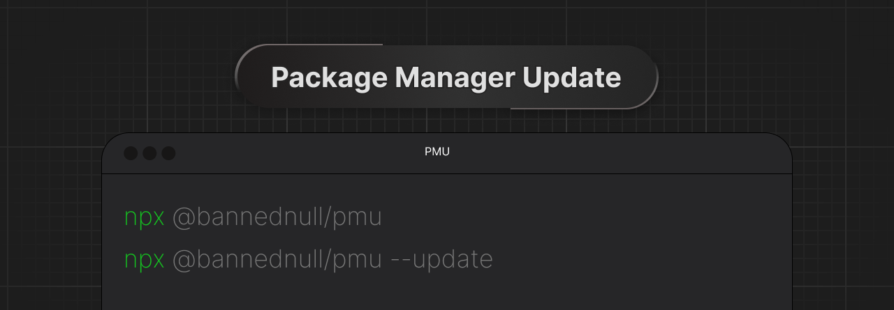

# PMU CLI


<p style="text-align: center;">A command line interface for managing outdated packages in your project.</p>

## Features
* Automatically detects the package manager in use (npm, yarn, or pnpm).
* Optionally updates all outdated packages with a single command.

## Requirements
* Node.js v12 or higher.
* A project with one of the following package managers:
  * npm
  * yarn
  * pnpm

## Installation

You can run PMU CLI directly using `npx`. No installation is required.

## Usage

### Show outdated packages

To list all outdated packages in your project, simply run:

```bash
npx @bannednull/pmu
```

This will detect your package manager (npm, yarn, or pnpm) and display a list of outdated packages, including their current and latest versions.

### Update all outdated packages

```bash
npx @bannednull/pmu --update
```

This will update each outdated package using the appropriate command for your package manager.
